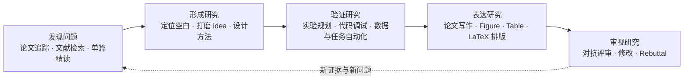

# Research AutoCode Toolkit

> 面向 AI 辅助科研全流程的可组合工具库：从问题发现、文献调研和 idea 打磨，到实验工程、论文写作、图表排版、对抗评审与 rebuttal。

Research AutoCode Toolkit is a composable research workbench for Codex, Claude Code, Cursor, and related coding agents.

## 这是什么

科研不是一串彼此独立的 prompt。一个可靠的研究流程需要持续维护问题定义、证据来源、创新性判断、实验路径、论文叙事、视觉表达和评审反馈之间的一致性。

这个仓库因此不把每个目录视为同级的 “skill 产品”，而是按科研任务组织三类能力：

1. **端到端工作流**：负责跨阶段编排、状态管理、质量门禁和最终交付。
2. **可组合研究工具**：解决文献检索、单篇精读、写作、作图、排版、审稿或调试等明确问题。
3. **实验室与项目适配器**：连接特定数据库、数据管线或存储服务；它们不是通用依赖。

你可以只使用一个工具，也可以把它们组合成从 research idea 到 submission-ready manuscript 的完整流程。

## 科研工作流



贯穿整个流程的不是“生成更多文字”，而是四项共同约束：

- **Evidence**：重要判断能够追溯到论文、实验、代码或数据。
- **Alignment**：claim、method、experiment、figure 和正文叙事互相对应。
- **Validation**：关键产物有可执行检查、独立评审或渲染后的视觉验收。
- **Provenance**：预测数据、未验证方案和外部来源均有明确标记，不与实测事实混淆。

## 从任务开始，而不是从目录开始

| 你现在要做什么 | 推荐入口 | 适合的结果 |
|---|---|---|
| 把一个粗略 idea 推进到完整论文初稿 | [idea2paper](idea2paper/) | 会议与模板、文献库、方法、实验设计、论文各章节、图表和待实测 TODO |
| 做系统、可审计的研究到写作全流程 | [academic-research-skills](academic-research-skills/) | 深度调研、论文写作、完整性检查、两轮评审与修订 |
| 查全某个 AI 方向的 prior art / Related Work | [ai-literature-survey](ai-literature-survey/) | 来源审计后的论文语料、覆盖分析、引用图谱和 Related Work |
| 持续追踪某个方向的新论文 | [track-ai-papers](track-ai-papers/) | 定期筛选、排序、精读和研究雷达摘要 |
| 深入理解一篇论文 | [nature-paper-card](nature-paper-card/) 或 [paper-read](.claude/skills/paper-read/) | 证据链 Paper Card，或结构化七问精读笔记 |
| 修改或对抗性审查一篇 CS 论文 | [paperjury](paperjury/) | 直接 LaTeX 修改、争议点裁决、可追踪的多轮审稿与修订 |
| 改善论文的图表浮动和分页 | [latex-float-layout](latex-float-layout/) | 经过 PDF 几何检查的 figure/table 重排 |
| 准备正式 rebuttal | [Skill-Research-Rebuttal](Skill-Research-Rebuttal/) | reviewer 意见组织、思维导图和逐条回复 |
| 迭代定位研究代码问题 | [autodebug](autodebug/) | 假设驱动的调试循环、可复用观测与跨轮次记忆 |
| 批量执行研究工程 TODO | [autorun](autorun/) | 带依赖调度、SQLite 状态和 reviewer 验收的任务执行 |
| 制作论文图、可编辑图或研究展示 | [gpt-image](gpt-image/)、[Skill-Research-Figure](Skill-Research-Figure/)、[drawio-figure-replicator](drawio-figure-replicator/) | ImageGen 图像、TikZ/Blender 图、可编辑 draw.io 复刻 |

## 推荐组合

### 1. 从 idea 到 experiment-ready paper

以 [idea2paper](idea2paper/) 作为主编排器。它负责：

- 根据研究方向和仍开放的摘要截止日期选择合适顶会，并获取官方或回退模板；
- 调用 [ai-literature-survey](ai-literature-survey/) 建立来源审计的 related-work corpus；
- 通过 novelty、feasibility 和 professor adjudication 反复打磨 idea；
- 冻结标题、贡献、Method、实验矩阵和正文叙事；
- 使用 Codex 系统 `imagegen` 生成并审计所有论文图；
- 调用 [paperjury](paperjury/) 做至少两轮对抗性评审；
- 检查 LaTeX、页数、TODO、图表分布、引用和 PDF 几何。

这个工作流的目标是：除实际实验数据与必须实测的实现结论外，其余内容达到可继续投稿迭代的状态。预测结果必须与替换 TODO 绑定，不能伪装成实测数据。

### 2. 从证据调研到正式论文

使用 [academic-research-skills](academic-research-skills/) 中的组合：

```text
deep-research
  -> academic-paper
  -> integrity check
  -> academic-paper-reviewer
  -> revise / re-review
  -> final integrity check
```

适合需要系统综述、跨领域研究、事实核查、方法学设计或多格式论文输出的任务。若重点是 AI/CV/NLP/ML/机器人领域的高召回文献检索，可把 [ai-literature-survey](ai-literature-survey/) 作为前置证据层。

### 3. 论文加固与投稿前检查

已有 LaTeX 稿件时，建议按以下顺序：

1. [research-paper-writing](research-paper-writing/) 检查章节结构、段落信息流和 claim–evidence 对齐；
2. [paperjury](paperjury/) 进行直接修改或多视角对抗评审；
3. [latex-float-layout](latex-float-layout/) 处理图表堆积、单栏空白、附录尾部拥塞和错误分页；
4. [Skill-Research-Rebuttal](Skill-Research-Rebuttal/) 在收到 reviewer comments 后组织正式回复。

### 4. 实验工程与长期任务

- [autodebug](autodebug/)：适合“为什么不工作”的开放式调试，强调假设、观测、控制变量和跨轮记忆。
- [autorun](autorun/)：适合已经写入 `TODO_LIST.md` 的批量任务，提供依赖调度、并行执行、SQLite 状态和逐项验收。
- [full-auto](full-auto/)：适合边界明确、可以无人值守完成的单个任务。
- [generate-docs](generate-docs/)：为研究代码生成分层 `CLAUDE.md`，帮助 agent 建立稳定的代码结构认知。

训练和推理不绑定任何固定平台。工具应先检查当前机器资源；只有当用户明确提供并授权计算后端时，才使用对应环境。

## 工具地图

### 文献、证据与研究发现

| 组件 | 作用 | 类型 |
|---|---|---|
| [track-ai-papers](track-ai-papers/) | 按研究方向持续发现、筛选、排序和推送近期高质量 AI 论文 | 持续工作流 |
| [ai-literature-survey](ai-literature-survey/) | 面向 AI/CV/NLP/ML/机器人等方向的高召回、来源审计文献检索 | 核心研究工具 |
| [paper-read](.claude/skills/paper-read/) | 按任务、挑战、模块、实验、局限和 future work 七问精读单篇论文 | 轻量研究工具 |
| [nature-paper-card](nature-paper-card/) | 生成带稳定证据指针、模块因果链和结论边界的 16 节 Paper Card | 深度研究工具 |
| [deep-research](academic-research-skills/deep-research/) | 多 agent 深度调研、系统综述、meta-analysis、事实核查和方法学设计 | 通用研究工作流 |

### Idea、论文写作与质量控制

| 组件 | 作用 | 类型 |
|---|---|---|
| [idea2paper](idea2paper/) | 从粗略 idea 到完整、experiment-ready 的 LaTeX paper sketch | 端到端编排器 |
| [academic-pipeline](academic-research-skills/academic-pipeline/) | research → write → integrity → review → revise → finalize | 端到端编排器 |
| [academic-paper](academic-research-skills/academic-paper/) | 多模式学术写作、修订、摘要、综述、格式转换和引用检查 | 通用写作工作流 |
| [academic-paper-reviewer](academic-research-skills/academic-paper-reviewer/) | EIC、领域 reviewer 与 Devil's Advocate 多视角审稿 | 通用评审工具 |
| [research-paper-writing](research-paper-writing/) | ML/CV/NLP 论文的章节结构、段落流与 reviewer-facing 写作指导 | 写作工具 |
| [Research-Paper-Writing-Skills](Research-Paper-Writing-Skills/) | `research-paper-writing` 的跨平台独立分发包装 | 兼容性包装 |
| [paperjury](paperjury/) | CS 顶会论文的直接编辑、对抗评审和自动加固 | 写作与评审系统 |
| [latex-float-layout](latex-float-layout/) | 基于编译 PDF 的 LaTeX 图表分布、空白和分页修复 | 排版质量工具 |
| [Skill-Research-Rebuttal](Skill-Research-Rebuttal/) | reviewer 意见分类、draw.io 总览和正式 rebuttal | 投稿后工具 |

### 视觉表达与研究展示

| 组件 | 作用 | 类型 |
|---|---|---|
| [gpt-image](gpt-image/) | 为系统 `imagegen` 检索参考风格并构造高质量生成/编辑提示 | ImageGen 提示层 |
| [Skill-Research-Figure](Skill-Research-Figure/) | 生成 TikZ pipeline、Blender 3D 渲染、骨架与 mesh figure | 论文作图工具 |
| [drawio-figure-replicator](drawio-figure-replicator/) | 将参考图、白板图或架构图复刻为可编辑 draw.io | 可编辑图工具 |
| [image-to-editable-ppt-skill](image-to-editable-ppt-skill/) | 将截图、扫描 PPT/PDF 重建为对象级可编辑 PowerPoint | 演示文稿工具 |
| [frontend-design](frontend-design/) | 构建研究主页、demo、dashboard、poster 或交互式展示界面 | 研究传播工具 |

在 `idea2paper` 工作流中，论文 Figure 必须遵循其 `imagegen`-only 合同；不要用其他作图工具静默替代。独立作图任务则按目标格式选择 ImageGen、TikZ/Blender 或 draw.io。

### 研究工程与 agent 自动化

| 组件 | 作用 | 类型 |
|---|---|---|
| [autodebug](autodebug/) | 假设驱动的 ReAct 调试、观测建设和三文件记忆 | 调试工作流 |
| [autorun](autorun/) | TODO 队列、依赖分析、并行执行、Dashboard 和 reviewer 验收 | 任务编排系统 |
| [full-auto](full-auto/) | 理解、规划、执行、自检和修复的一次性无人值守模式 | 执行工作流 |
| [generate-docs](generate-docs/) | 基于增量分析生成分层项目文档 | 代码理解工具 |
| [pua](pua/) | 面向长期复杂任务的高主动性、失败恢复和多语言行为约束 | Agent 行为扩展 |

### 数据与实验室适配器

这些组件服务于特定项目或内部基础设施，不应被视为通用科研工作流的必选依赖。使用前必须检查路径、数据库、服务权限和数据边界。

| 组件 | 作用 | 适用范围 |
|---|---|---|
| [db-analyze](db-analyze/) | 分析指定 SQLite 数据库的表、列与空间占用 | HYMotion 数据库布局 |
| [mysql-motiondata](mysql-motiondata/) | 查询和操作 `hymotion_data` MySQL 数据库 | HYMotion |
| [query-motion-database](query-motion-database/) | 查看动作数据管线的漏斗、队列与完成进度 | HYMotion |
| [sync-ceph-data](sync-ceph-data/) | 通过指定 OpenAPI 在 CEPH 路径间同步数据 | 智研存储环境 |

[nature-shared](nature-shared/) 提供 `nature-paper-card` 等工具复用的来源准备和证据处理代码，属于内部共享模块，不是独立入口。

## 安装与使用

### 1. 获取仓库

```bash
git clone https://github.com/ZeyuLing/research_autocode_skills.git
cd research_autocode_skills
```

### 2. 选择需要的工作流

这个仓库不是一个需要整体安装的单体 Python 包。优先根据上面的任务入口选择组件，并阅读对应目录中的 `SKILL.md` 或 `README.md`：

- Codex 用户通常将所需组件放入 `$CODEX_HOME/skills`；
- Claude Code 项目通常使用 `.claude/skills`；
- Cursor、Gemini、OpenCode 等平台请遵循组件自己的兼容说明；
- `academic-research-skills`、`Skill-Research-Figure`、`Skill-Research-Rebuttal` 等是带多个资源或子工具的 bundle，应按各自 README 安装，不要只复制其中一个文件。

### 3. 安装组件依赖

依赖按组件声明，不提供一个覆盖全部目录的全局环境：

- LaTeX/PDF 工具用于论文编译、排版和渲染检查；
- Python 依赖写在组件的 `requirements.txt` 或说明文档中；
- Blender 仅用于需要 3D 渲染的 figure；
- `gpt-image` 和 `idea2paper` 的图像生成依赖 Codex 系统 `imagegen`；
- 部分编排器依赖其他工具，例如 `idea2paper` 需要 `ai-literature-survey`、`paperjury` 和系统 `imagegen`。

缺少强依赖时，工作流应明确停止并报告缺口，不应静默换成质量更低或语义不同的替代方案。

### 4. 用研究目标触发

多数工具既支持名称触发，也支持自然语言。例如：

```text
用 idea2paper 把这个 motion generation idea 写成实验就绪的论文初稿
调研显式动作规划与 text-to-motion 的最新相关工作
精读这篇论文，给我模块—问题—证据的因果链
对这篇 CVPR LaTeX 做两轮对抗性审稿并直接修改
修复附录图表扎堆和单栏大面积留白
```

## 设计原则

- **以科研问题为入口**：用户选择的是任务和交付物，不需要先理解所有组件。
- **编排器与原子工具分离**：端到端流程负责状态和质量门禁，单点工具保持边界清晰、可独立复用。
- **事实、推断和 TODO 分离**：特别是论文中的预测实验数据和未验证实现，不得伪装为已经测得的结论。
- **质量以产物验证为准**：论文需要编译后的 PDF 检查，图需要最终尺寸审阅，代码需要测试或最小复现，文献需要来源审计。
- **允许项目适配，不污染通用层**：硬编码路径、数据库或内部服务只能存在于明确标记的适配器中。
- **组合必须显式**：跨工具依赖、输入输出、替代策略和失败条件都应该写清楚。

## 仓库边界

- 当前重点是 AI、ML、CV、NLP、机器人、multimodal 和相关计算机科学研究。
- 不是所有组件都支持所有 agent 平台；以组件元数据和 README 为准。
- 不是所有目录都具有相同的通用性或成熟度；项目适配器与核心科研工具明确分层。
- 仓库不提供统一的云资源、数据库或凭据。任何外部写入、任务提交或数据操作都受用户授权和目标系统权限约束。
- 各子项目可能保留其原始许可与来源信息；使用或再分发前请检查对应目录。

## 安全

- 不要把 API token、SSH 密码、数据库口令或私有数据路径提交到仓库。
- 安装项目适配器前，先审查其中的环境变量、服务地址、默认路径和写操作。
- 删除包含凭据的当前文件不会自动清除 Git 历史；如果敏感信息曾被提交，应轮换凭据，并在明确评估影响后单独清理历史。
- 对外部平台的提交、删除、停止任务和覆盖数据等操作，必须遵循用户授权与最小影响原则。

## 贡献新的科研工具

新增组件时，请先回答以下问题，而不是只新增一个 `SKILL.md`：

1. 它解决科研流程中的哪个问题，输入和可验证输出是什么？
2. 它是端到端编排器、通用工具，还是项目适配器？
3. 它与现有工具如何组合，是否存在重复能力或硬依赖？
4. 哪些结论需要来源、实验、渲染或测试验证？
5. 失败时应该停止、降级还是请求用户决策？
6. 是否包含环境绑定、隐私数据、外部写操作或凭据风险？

同时更新本 README 的任务入口或工具地图，提供最小可运行示例，并确保仓库中不包含密钥和用户私有数据。
