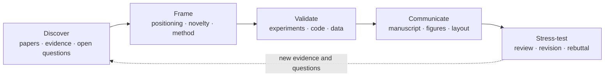

<p align="center">
  <picture>
    <source media="(prefers-color-scheme: dark)" srcset="docs/assets/research-autocode-toolkit-logo-dark.png">
    <source media="(prefers-color-scheme: light)" srcset="docs/assets/research-autocode-toolkit-logo.png">
    
  </picture>
</p>

<h1 align="center">Research AutoCode Toolkit</h1>

<p align="center">
  <strong>Composable, evidence-aware workflows for agent-assisted research.</strong>
</p>

<p align="center">
  From literature discovery and idea refinement to experiment planning, manuscript development,<br>
  scientific figures, adversarial review, and rebuttal.
</p>

<p align="center">
  <a href="README.md"><strong>English</strong></a>
  ·
  <a href="README.zh-CN.md">简体中文</a>
</p>

<p align="center">
  <a href="https://github.com/ZeyuLing/research_autocode_skills/stargazers"></a>
  <a href="https://github.com/ZeyuLing/research_autocode_skills/commits/main"></a>
  <a href="README.zh-CN.md"></a>
</p>

<p align="center">
  <a href="#why-this-toolkit">Why</a> ·
  <a href="#research-lifecycle">Lifecycle</a> ·
  <a href="#start-with-an-outcome">Choose a workflow</a> ·
  <a href="#quick-start">Quick start</a> ·
  <a href="#tool-map">Tool map</a> ·
  <a href="#contributing">Contributing</a>
</p>

---

## Why this toolkit

Research is not a sequence of isolated prompts. A dependable workflow must keep the research question, source evidence, novelty argument, experimental plan, manuscript narrative, visual communication, and reviewer feedback aligned as the project evolves.

Research AutoCode Toolkit organizes reusable `SKILL.md` workflows around **research outcomes**, not around a flat list of agent commands. Components can be used independently or composed into larger pipelines.

| Layer | Responsibility | Examples |
|---|---|---|
| **Orchestrated workflows** | Coordinate multiple research stages, preserve state, and enforce quality gates | [idea2paper](idea2paper/), [academic-pipeline](academic-research-skills/academic-pipeline/), [autorun](autorun/) |
| **Focused research tools** | Solve a bounded task such as literature search, paper editing, figure creation, layout repair, or debugging | [ai-literature-survey](ai-literature-survey/), [paperjury](paperjury/), [latex-float-layout](latex-float-layout/), [autodebug](autodebug/) |
| **Project adapters** | Connect a specific database, data pipeline, or storage service | [mysql-motiondata](mysql-motiondata/), [query-motion-database](query-motion-database/), [sync-ceph-data](sync-ceph-data/) |

Four contracts run through the toolkit:

- **Evidence** — important claims should trace back to papers, experiments, code, or data.
- **Alignment** — claims, methods, experiments, figures, and prose should support one another.
- **Validation** — deliverables should be checked through tests, independent review, compilation, or rendered inspection.
- **Provenance** — measured facts, forecasts, unverified options, and external sources must remain distinguishable.

> [!NOTE]
> This repository is a component-based research tooling collection, not a monolithic package. Runtime compatibility, dependencies, provenance, validation coverage, and licensing vary by component.

## Research lifecycle



The toolkit supports the loop rather than treating publication as the end of a linear pipeline.

## Start with an outcome

| Research outcome | Start here | Typical deliverable |
|---|---|---|
| Turn an early idea into an experiment-ready manuscript scaffold | [idea2paper](idea2paper/) | Venue-aware LaTeX project, literature corpus, refined method, experiment matrix, figures, and explicit verification TODOs |
| Build an auditable research-to-writing workflow | [academic-research-skills](academic-research-skills/) | Research synthesis, manuscript, integrity checks, multi-perspective review, and revision |
| Map prior art or repair Related Work | [ai-literature-survey](ai-literature-survey/) | High-recall, source-audited literature corpus and coverage report |
| Track important papers in a research area | [track-ai-papers](track-ai-papers/) | Screened and ranked research-radar digest |
| Deep-read one paper | [nature-paper-card](nature-paper-card/) or [paper-read](.claude/skills/paper-read/) | Evidence-linked Paper Card or structured seven-question reading note |
| Stress-test and revise a CS paper | [paperjury](paperjury/) | Reviewer-style issues, adjudication, and controlled LaTeX edits |
| Blind-review a Chinese CS master's or doctoral thesis | [thesis_review](thesis_review/) | Three- or five-reviewer independent reports, chair adjudication, full-document anonymity, exhaustive claim--citation and physical-page pagination audits, and a revision ledger |
| Repair figure/table placement in LaTeX | [latex-float-layout](latex-float-layout/) | Compile-and-inspect float redistribution and pagination fixes |
| Prepare an author response | [Skill-Research-Rebuttal](Skill-Research-Rebuttal/) | Review map, response strategy, and rebuttal draft |
| Diagnose research code iteratively | [autodebug](autodebug/) | Hypothesis-driven debugging loop with persistent observations |
| Execute a research TODO queue | [autorun](autorun/) | Dependency-aware execution, task state, and reviewer-style acceptance checks |

## Quick start

### 1. Clone the collection

```bash
git clone https://github.com/ZeyuLing/research_autocode_skills.git
cd research_autocode_skills
```

### 2. Choose a component

Start from the outcome table above, then read the component's complete `SKILL.md` or README. Do not copy only `SKILL.md` when the component also contains scripts, references, assets, templates, or tests.

### 3. Install it for your agent

Installation is component-scoped. Typical locations are:

| Runtime | Typical destination | Important caveat |
|---|---|---|
| Codex | `$CODEX_HOME/skills/<component>` | Runtime-provided system skills such as `imagegen` must be available separately |
| Claude Code | `.claude/skills/<component>` | Some bundled repositories already contain a `.claude/skills` layout |
| Cursor, Gemini, OpenCode, others | Follow the component README | Support is not uniform across this collection |

Example for one standalone component:

```bash
# Codex example (set CODEX_HOME first)
mkdir -p "$CODEX_HOME/skills"
cp -R ai-literature-survey "$CODEX_HOME/skills/ai-literature-survey"

# Claude Code project example
mkdir -p .claude/skills
cp -R autodebug .claude/skills/autodebug
```

PowerShell example for Codex:

```powershell
if ([string]::IsNullOrWhiteSpace($env:CODEX_HOME)) { throw 'Set CODEX_HOME first.' }
$skillRoot = Join-Path $env:CODEX_HOME 'skills'
New-Item -ItemType Directory -Force -Path $skillRoot | Out-Null
Copy-Item -Recurse -Force ai-literature-survey (Join-Path $skillRoot 'ai-literature-survey')
```

Bundles such as [academic-research-skills](academic-research-skills/), [Skill-Research-Figure](Skill-Research-Figure/), and [Skill-Research-Rebuttal](Skill-Research-Rebuttal/) have their own installation instructions. Follow those instructions instead of flattening their directory structure.

### 4. Install only the component's dependencies

There is intentionally no root-level `pip install` or `npm install` command. Examples of component-scoped requirements include:

- [idea2paper](idea2paper/) — Python 3.10+, `pdfplumber`, LaTeX/PDF tooling, `ai-literature-survey`, `paperjury`, and Codex's system `imagegen`;
- [paperjury](paperjury/) — its own Node.js/toolkit requirements;
- [image-to-editable-ppt-skill](image-to-editable-ppt-skill/) — its own Python CLI environment;
- [Skill-Research-Figure](Skill-Research-Figure/) — LaTeX/TikZ or Blender only for the selected rendering path.

When a hard dependency is unavailable, a workflow should report the missing requirement instead of silently replacing it with a semantically different tool.

### 5. Ask for the research outcome

```text
Use idea2paper to turn this motion-generation idea into an experiment-ready manuscript scaffold.
Survey explicit motion planning and text-to-motion prior art, with source and code availability.
Deep-read this paper and map each module to the challenge and evidence it addresses.
Run a pre-submission adversarial review of this CVPR LaTeX project and apply safe edits.
Repair appendix float clustering and large single-column blank regions.
```

## Featured workflows

| Workflow | Composition | What it is designed to produce |
|---|---|---|
| **Idea → manuscript scaffold** | `idea2paper` → `ai-literature-survey` → agent deliberation → `imagegen` → `paperjury` → PDF/layout checks | A submission-oriented draft with an explicit evidence corpus, method rationale, experiment plan, figures, and verification TODOs |
| **Evidence → academic manuscript** | `deep-research` → `academic-paper` → integrity checks → `academic-paper-reviewer` → revision | A structured research synthesis and manuscript with repeated review passes |
| **Pre-submission hardening** | `research-paper-writing` → `paperjury` → `latex-float-layout` | Clearer argumentation, adversarial issue discovery, controlled edits, and render-verified layout repair |
| **Research engineering** | `generate-docs` / `autorun` → `autodebug` → acceptance checks | Better project context, dependency-aware execution, and evidence-driven debugging |

Predicted experimental values are not measured results. Workflows that use forecasts must bind them to visible replacement TODOs; authors remain responsible for running experiments and verifying every claim before submission.

## Tool map

<details open>
<summary><strong>Literature, evidence, and research discovery</strong></summary>

| Component | Purpose |
|---|---|
| [track-ai-papers](track-ai-papers/) | Discover, screen, rank, and deliver recent papers for a research area |
| [ai-literature-survey](ai-literature-survey/) | High-recall, source-audited literature discovery for AI and adjacent fields |
| [paper-read](.claude/skills/paper-read/) | Seven-question deep reading of one paper |
| [nature-paper-card](nature-paper-card/) | Evidence-grounded 16-section Paper Card with module logic and conclusion boundaries |
| [deep-research](academic-research-skills/deep-research/) | Multi-agent research, systematic review, fact-checking, and methodology design |

</details>

<details>
<summary><strong>Idea development, writing, and review</strong></summary>

| Component | Purpose |
|---|---|
| [idea2paper](idea2paper/) | Orchestrate a rough idea into an experiment-ready LaTeX manuscript scaffold |
| [academic-pipeline](academic-research-skills/academic-pipeline/) | Coordinate research, writing, integrity checks, review, revision, and finalization |
| [academic-paper](academic-research-skills/academic-paper/) | Draft, revise, summarize, review citations, and convert academic documents |
| [academic-paper-reviewer](academic-research-skills/academic-paper-reviewer/) | Simulate multi-perspective editorial and peer-review lenses |
| [research-paper-writing](research-paper-writing/) | Improve section structure, paragraph flow, and claim–evidence alignment |
| [Research-Paper-Writing-Skills](Research-Paper-Writing-Skills/) | Cross-platform distribution wrapper for `research-paper-writing` |
| [paperjury](paperjury/) | Directly edit or adversarially stress-test CS-conference LaTeX papers |
| [thesis_review](thesis_review/) | Run institution-aware, independent 3/5-reviewer simulations with full-document blind-copy checks plus mandatory full-citation and physical-page/forced-float ledgers |
| [latex-float-layout](latex-float-layout/) | Rebalance LaTeX figures, tables, whitespace, and pagination |
| [Skill-Research-Rebuttal](Skill-Research-Rebuttal/) | Organize reviewer feedback and develop an author response |

</details>

<details>
<summary><strong>Figures and research communication</strong></summary>

| Component | Purpose |
|---|---|
| [gpt-image](gpt-image/) | Reference and prompt layer for Codex's system `imagegen` |
| [Skill-Research-Figure](Skill-Research-Figure/) | Produce TikZ pipelines and Blender-based 3D research figures |
| [drawio-figure-replicator](drawio-figure-replicator/) | Recreate reference diagrams as editable draw.io assets |
| [image-to-editable-ppt-skill](image-to-editable-ppt-skill/) | Rebuild slide images or scanned decks as object-level editable PowerPoint |
| [frontend-design](frontend-design/) | Build research pages, demos, dashboards, posters, and interactive presentations |

Inside an `idea2paper` run, its `imagegen`-only figure contract takes precedence. Independent figure tasks can choose ImageGen, TikZ/Blender, or draw.io according to the required artifact.

</details>

<details>
<summary><strong>Research engineering and agent automation</strong></summary>

| Component | Purpose |
|---|---|
| [autodebug](autodebug/) | Hypothesis-driven ReAct debugging with persistent research notes |
| [autorun](autorun/) | Schedule and execute TODO queues with SQLite state and acceptance review |
| [full-auto](full-auto/) | Run a bounded task through planning, execution, self-review, and repair |
| [generate-docs](generate-docs/) | Generate incremental, layered project documentation |
| [pua](pua/) | Add high-agency behavior, failure recovery, and multilingual pressure modes |

Training and inference are not bound to a fixed cluster. These tools should inspect the current environment and use an external compute backend only when the user has explicitly provided and authorized it.

</details>

<details>
<summary><strong>Project-specific data adapters</strong></summary>

| Component | Scope |
|---|---|
| [db-analyze](db-analyze/) | Analyze table, column, and storage usage for a specific SQLite layout |
| [mysql-motiondata](mysql-motiondata/) | Operate the HYMotion `hymotion_data` MySQL database |
| [query-motion-database](query-motion-database/) | Inspect HYMotion pipeline funnels, queues, and completion state |
| [sync-ceph-data](sync-ceph-data/) | Synchronize CEPH paths through a designated storage API |

These adapters are environment-specific. Review service endpoints, paths, credentials, permissions, and write behavior before use.

</details>

[nature-shared](nature-shared/) contains source-preparation and evidence-processing code shared by `nature-paper-card` and related tools. It is an internal support module, not a standalone entry point.

## How the toolkit composes

```text
Orchestrator
  ├─ focused research tools
  ├─ evidence and artifact stores
  ├─ validation / review gates
  └─ optional project adapters
```

Composition rules:

1. **Dependencies are explicit.** An orchestrator must name the tools it requires.
2. **Adapters are opt-in.** Project-specific infrastructure is never a silent default.
3. **Fallbacks preserve semantics.** Missing dependencies are reported when substitution would change the research contract.
4. **Artifacts remain inspectable.** Sources, prompts, TODOs, reviews, figures, and validation records should stay with the project.
5. **External writes remain authorized.** Publishing, task submission, database writes, and data movement require the user's scope and target.

## Examples

| Area | Repository examples |
|---|---|
| End-to-end academic workflows | [academic-research-skills/examples](academic-research-skills/examples/) |
| Editable diagram reconstruction | [drawio-figure-replicator/examples](drawio-figure-replicator/examples/) |
| Adversarial paper review | [paperjury/samples/dogfood](paperjury/samples/dogfood/) |
| TikZ and Blender research figures | [Skill-Research-Figure/examples](Skill-Research-Figure/examples/) |
| Rebuttal organization | [Skill-Research-Rebuttal/example](Skill-Research-Rebuttal/example/) |

Examples belong to their respective components and may require component-specific runtimes or assets.

## Requirements and compatibility

- There is no single repository-wide runtime or dependency lock.
- Component metadata and README files are the source of truth for supported agents, tools, and operating assumptions.
- Some components are Codex-first, some are Claude Code-first, and some are portable prompt/workflow packages.
- Python, Node.js, LaTeX, Poppler, Blender, ImageGen, databases, or external services are required only by the components that declare them.
- A bundle's nested files, templates, scripts, and references are part of its runtime contract.

Before adopting a component, check:

- its `SKILL.md` front matter and allowed tools;
- its README, requirements, package metadata, and environment variables;
- whether it performs external reads or writes;
- whether paths or services are specific to one lab or project;
- its license and upstream provenance.

## Quality and responsible use

- **Literature discovery is high-recall, not guaranteed exhaustive.** Verify important citations against primary sources.
- **Generated prose is a draft, not authorial sign-off.** Authors own the argument, attribution, and final submission.
- **Predicted results are targets, not measurements.** Keep visible TODOs until raw experimental results replace them.
- **Adversarial review is a stress test, not a substitute for peer review.**
- **Rendered artifacts need rendered inspection.** Compile papers, inspect PDFs, and review figures at final display size.
- **Research claims should remain falsifiable.** Do not use workflow completion as evidence that a scientific claim is true.

## Security and private infrastructure

- Never add API tokens, SSH passwords, database credentials, or private data paths to public commits.
- Lab adapters are configured through environment variables and may access private endpoints, paths, or credentials at runtime. Keep actual values out of commits and logs.
- Any credential-like value that appeared in an earlier revision must be treated as compromised: rotate it, audit downstream access, and assess whether Git history requires a coordinated rewrite.
- Inspect environment variables, endpoints, defaults, permissions, and write operations before installing an adapter.
- Use least privilege for databases, storage APIs, compute backends, and publishing services.
- Treat task submission, deletion, cancellation, publication, and data overwrite as external state changes that require clear authorization.

## Contributing

Contributions should improve a research outcome, not merely add another prompt file. A new component should document:

1. the research problem it solves and its verifiable output;
2. whether it is an orchestrator, focused tool, support module, or project adapter;
3. inputs, outputs, dependencies, side effects, and failure behavior;
4. evidence, tests, compilation, rendering, or review used for validation;
5. supported runtimes and known environment assumptions;
6. provenance, license, and any third-party assets;
7. a minimal example and an update to this README's task map when relevant.

Before opening a change, remove secrets and private data, keep unrelated files out of the commit, and run the component's available checks.

## Provenance and licenses

This repository contains original, adapted, bundled, and vendored components. **Licensing is component-scoped.** A component's own license and provenance notice take precedence over this README.

Examples of declared component licenses include MIT, Apache-2.0, and CC BY-NC 4.0; several components do not currently include an explicit license file. Components without an explicit license should not be assumed to grant reuse or redistribution rights.

Review the relevant component directory before use, modification, commercial deployment, or redistribution. Upstream references are recorded in component README files, package metadata, license files, and notices such as [nature-paper-card/UPSTREAM.md](nature-paper-card/UPSTREAM.md).

## Feedback

Public issue creation is currently restricted. External contributors can propose concrete, scoped fixes through [pull requests](https://github.com/ZeyuLing/research_autocode_skills/pulls) from a fork; general support is not currently offered. Do not disclose credentials, private endpoints, or sensitive research data in a public pull request.
