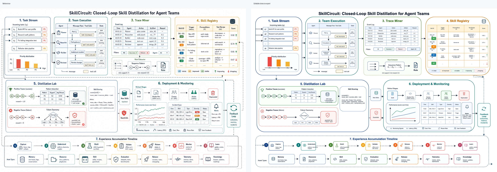
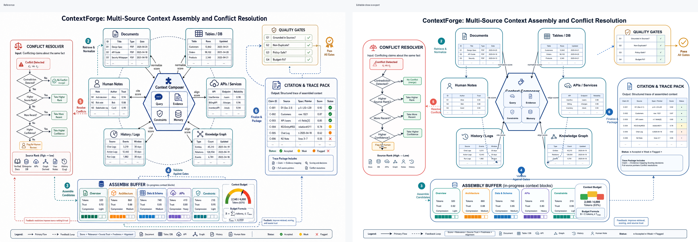

# Draw.io Figure Replicator

[English](README.md) | [中文](README.zh-CN.md)

Turn reference diagrams into editable draw.io / diagrams.net files with AI agents.

Most AI diagram tools start from text. This skill starts from a reference image: a paper figure, architecture screenshot, whiteboard photo, workflow diagram, or generated visual comp. The agent rebuilds it as native draw.io XML with editable boxes, arrows, labels, tables, and portable SVG icon assets.



## Why This Exists

AI image generation is useful for visual exploration, but it usually produces dead images. Teams need diagrams they can inspect, edit, version, localize, and maintain.

This skill gives an agent a disciplined workflow for faithful figure recreation:

- inspect the reference image dimensions, layout, colors, typography, arrows, and repeated components
- decide which elements should be draw.io primitives and which need standalone SVG assets
- generate coordinate-based `.drawio` XML instead of manual dragging
- embed SVG assets as portable data URIs
- keep text, boxes, arrows, tables, and labels editable
- export a PNG preview and compare it against the reference before delivery

## Best For

- academic paper figure recreation
- project architecture diagram cleanup
- screenshot-to-editable-diagram conversion
- workflow and process diagram reconstruction
- generated-image comp to maintainable draw.io
- reusable SVG icon extraction for diagrams

## Not For

- generic text-to-diagram generation
- Mermaid-only diagrams
- full-slide PNG embedding
- brand logo tracing without permission
- pixel-perfect vectorization of artwork that should remain an image

## Install

Copy the skill folder into your agent's skills directory.

For Codex:

```bash
mkdir -p ~/.codex/skills
cp -R skills/drawio-figure-replication ~/.codex/skills/
```

For Claude Code:

```bash
mkdir -p ~/.claude/skills
cp -R skills/drawio-figure-replication ~/.claude/skills/
```

Restart or refresh your agent so the skill list is reloaded.

## Recommended Tooling

The skill can guide XML generation without extra tools, but validation is much better with:

- diagrams.net Desktop / draw.io Desktop
- `xmllint`
- an image inspection tool such as PIL, ImageMagick, or the agent's image viewer

On macOS, draw.io Desktop export usually works with:

```bash
/Applications/draw.io.app/Contents/MacOS/draw.io -x -f png -o output.png input.drawio
```

## Example Prompt

```text
Recreate this reference architecture figure as editable draw.io.

Requirements:
- preserve the major layout regions and reading order
- keep text, arrows, boxes, and labels editable
- create standalone SVG assets only for reusable icons
- export a PNG preview and compare it with the reference
```

## Examples

### SkillCircuit: Modular Large-Figure Recreation


[SkillCircuit](examples/skillcircuit/README.md) demonstrates the module-first workflow for dense figures. The reference is split into seven panels, each checked with module-level QA crops before final integration:

- Task stream
- Team execution
- Trace mining
- Skill registry
- Distillation lab
- Deployment monitoring
- Experience accumulation timeline

Files: [draw.io](examples/skillcircuit/skillcircuit.drawio), [PNG export](examples/skillcircuit/skillcircuit.png), [full comparison](examples/skillcircuit/comparison.png), [module QA](examples/skillcircuit/module-qa-contact-sheet.png).

### ContextForge: High-Density Academic Framework



[ContextForge](examples/contextforge/README.md) is a high-density academic-style framework figure recreation:

- Multi-source context assembly
- Conflict resolution workflow
- Quality gates
- Citation and trace packaging
- Assembly buffer and feedback loop

Files: [draw.io](examples/contextforge/contextforge.drawio), [PNG export](examples/contextforge/contextforge.png), [full comparison](examples/contextforge/comparison.png).

### Additional Concept Board

See [examples/concept-board](examples/concept-board/README.md) for four additional generated-reference recreations:

- Research Framework
- Agent Platform Architecture
- Model Pipeline
- Experience Flywheel

Each example includes an editable `.drawio` file, exported PNG preview, standalone SVG assets, and a regeneration script.

## Output Contract

A good run creates an isolated folder near the reference image:

```text
figure-name_recreated/
├── figure-name.drawio
├── figure-name.png
├── SVG_ASSETS.md
└── svg/
    ├── icon-1.svg
    └── icon-2.svg
```

The `.drawio` file should not be a single pasted screenshot. It should contain editable draw.io cells for major shapes, text, connectors, tables, and labels.

## Market Positioning

The draw.io AI ecosystem is moving fast. Official draw.io MCP tooling and other community skills are strong for text-to-diagram generation and editor control. This project is deliberately narrower:

> Reference image in, editable draw.io recreation out.

See [research/market-scan.md](research/market-scan.md) for a comparison with existing public tools.

## Repository Layout

```text
.
├── README.md
├── README.zh-CN.md
├── LICENSE
├── MANIFEST.md
├── research/
│   └── market-scan.md
└── skills/
    └── drawio-figure-replication/
        ├── SKILL.md
        ├── agents/
        │   └── openai.yaml
        └── references/
            └── drawio-xml-patterns.md
```

## License

MIT. This project is not affiliated with draw.io or diagrams.net.
