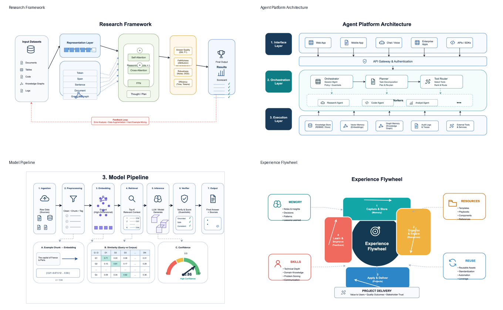

# Concept Board Examples

This folder contains four independent draw.io recreations derived from the generated concept-board reference image.

## Files

| Example | Editable draw.io | PNG preview | SVG assets |
| --- | --- | --- | --- |
| Research Framework | [research-framework.drawio](research-framework/research-framework.drawio) | [research-framework.png](research-framework/research-framework.png) | [SVG_ASSETS.md](research-framework/SVG_ASSETS.md) |
| Agent Platform Architecture | [agent-platform-architecture.drawio](agent-platform-architecture/agent-platform-architecture.drawio) | [agent-platform-architecture.png](agent-platform-architecture/agent-platform-architecture.png) | [SVG_ASSETS.md](agent-platform-architecture/SVG_ASSETS.md) |
| Model Pipeline | [model-pipeline.drawio](model-pipeline/model-pipeline.drawio) | [model-pipeline.png](model-pipeline/model-pipeline.png), [comparison.png](model-pipeline/comparison.png) | [SVG_ASSETS.md](model-pipeline/SVG_ASSETS.md) |
| Experience Flywheel | [experience-flywheel.drawio](experience-flywheel/experience-flywheel.drawio) | [experience-flywheel.png](experience-flywheel/experience-flywheel.png) | [SVG_ASSETS.md](experience-flywheel/SVG_ASSETS.md) |

## Notes

- The `.drawio` files are uncompressed XML for readability.
- Major boxes, labels, arrows, tables, and callouts are editable draw.io cells.
- Icons are saved as standalone SVGs and embedded into the draw.io files as portable data URIs.
- `generate_examples.mjs` is included so the examples can be regenerated after layout changes.
- `model-pipeline/comparison.png` shows the reference crop next to the editable draw.io export; this is the review artifact to use when improving figure fidelity.
